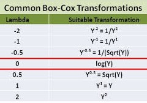

# Anova

```{r}
library(tidyverse)
```

## Un solo factor {-} 

experimento DCA: dataset `PlantGrowth`

`?PlantGrowth`

```{r}
pg <- PlantGrowth # simplificamos el nombre del dataset
```

- Exploración  

```{r}
str(pg) # tipo de variables
```

```{r}
summary(pg) # exploración numérica
```

Exploración numérica

```{r}
pg %>% 
  group_by(group) %>% 
  summarise(
    n= sum(!is.na(weight)), 
    mean = mean(weight),
    sd = sd(weight), 
    se = sd(weight)/sqrt(n))
```

Exploración gŕafica

```{r}
pg %>% 
  ggplot(aes(x=group, y=weight)) + 
  geom_boxplot(width=0.2)+
  geom_jitter(alpha=0.2, width=0.1)
```

Ajuste del modelo lineal

$$y_{ij} = \mu + \alpha_i + e_{ij}; \:\:i = 1,..., k; \:j = 1,..., n$$
$$N \sim (\sigma^2, 0)$$

```{r}
mod1 <- lm(weight ~ group, data = pg)  
```

- Diagnósticos

¿Las varianzas (entre niveles del factor) son homogéneas? 

```{r}
# homocedasticidad
plot(mod1, which = 1)
car::leveneTest(mod1)
```

¿Los residuos se distribuyen normales?

```{r}
plot(mod1, which = 2)
shapiro.test(rstandard(mod1))
```

```{r}
anova(mod1)# caso balanceado
summary(mod1)
# car::Anova(mod1)# caso desbalanceado
```

Test de comparaciones múltiples (de medias estimadas de los tratamientos)

Paquete [emmeans](https://cran.r-project.org/web/packages/emmeans/vignettes/vignette-topics.html)
```{r}
pacman::p_load(
  emmeans,  # medias estimadas por el modelo  
  multcomp  # comparar las medias entre si - tukey
  )
```

Medias e intervalos de confianza estimadas por el modelo

```{r}
em <- emmeans(mod1, ~ group, type="response")
em
```

Comparaciones múltiples 

```{r}
res  <- cld(em, 
            Letters = letters, 
            reverse = FALSE, 
            alpha = .05)  
res
```


```{r}
plot(res)
res_tbl <- res %>% as_tibble()
```

Graficar los resultados obtenidos del anova

- Opción A)

```{r}
p1 <- res_tbl %>%  
  mutate(group = fct_relevel(group, "ctrl", "trt1")) %>% 
  ggplot() +
  aes(x=group, y=emmean)+
  geom_pointrange(aes(ymin = lower.CL, ymax = upper.CL))+
  geom_jitter(data = pg %>% rename("emmean" = weight), 
             aes(x = group, y = emmean),
             width = .1, alpha=0.2) +
  geom_hline(
    yintercept = filter(res_tbl, group=="ctrl") %>% pull(emmean), 
    linetype = 2, col ="gray50")+
  labs(x = "Tratamiento", y = "Peso (g)")+  
  scale_y_continuous(breaks=scales::breaks_pretty(6))+
  geom_text(vjust=-1, angle=90, 
            aes(label = str_squish(.group)))+
  theme_bw()
p1
```

- Opción B)

```{r}
p2 <- res_tbl %>%  
  mutate(group = fct_relevel(group, "ctrl", "trt1")) %>% 
  ggplot() +
  aes(x=group, y=emmean)+
  geom_col(width=0.4)+
  geom_errorbar(aes(ymin = lower.CL, ymax = upper.CL),
                width=0.1)+  
  geom_hline(
    yintercept = filter(res_tbl, group=="ctrl") %>% pull(emmean), 
    linetype = 2, col ="gray50")+
  labs(x = "Tratamiento", y = "Peso (g)")+  
    scale_y_continuous(breaks=scales::breaks_pretty(6), 
                     limits = c(0,7))+
  geom_text(vjust=-2, aes(label = str_squish(.group)))+
  theme_bw()
p2
```

```{r}
pacman::p_load(patchwork)

p1 + p2 +
  plot_annotation(title = 'Alternativas de presentación de resultados', 
                  tag_levels = 'A', 
                  subtitle = "A) geom_pointrange() + geom_jitter()\nB) geom_col() + geom_errorbar()") 
```

:::{#box1 .blue-box}

Como graficaríamos con el mismo dataset - sin cálculos previos

```{r}
pg %>% 
  ggplot()+
  aes(x=group, y = weight) + 
  stat_summary(fun=mean, geom="bar", col="black", fill= "lightgrey", width=.5) +
  stat_summary(fun.data = mean_se, geom = "errorbar", width=.1)+
  labs(x = "Tratamiento", y = "Peso (g)")+    
  scale_y_continuous(breaks=scales::breaks_pretty(6), 
                     limits = c(0,7))+
  theme_bw()
```

:::

Comparación de medias de los trat vs testigo (Dunnet)

```{r}
contrast(em, "trt.vs.ctrl1")
```

Comparación de medias por LSD

```{r}
library(agricolae)

res_lsd <- LSD.test(y = mod1, 
                    trt = "group",
                    group = T, 
                    console = T)
res_lsd
bar.group(x = res_lsd$groups, 
          ylim=c(0, 7),
          # main="Prueba de comparación de medias por medio del método LSD",
          # xlab="Tipo de Mezcla",
          # ylab="Rendimiento del proceso",
          col="steelblue")

```

```{r}
save(list=ls(), file="anova_report.Rda")

```


## Dos factores {-} 

```{r}
library(tidyverse)
?ToothGrowth
tg <- ToothGrowth
```

- Exploración  

```{r}
str(tg) # tipo de variables
```

```{r}
tg1 <- tg %>% mutate_at(vars(dose), as.factor) 
```

```{r}
summary(tg1) # exploración numérica
```

```{r}
# exploracion numerica por tratamiento
tg1 %>%
  group_by(supp, dose) %>%
  summarise(
    count = sum(!is.na(len)),
    mean = mean(len, na.rm = TRUE),
    sd = sd(len, na.rm = TRUE)
  )
```

```{r}
pacman::p_load(plotly)
```

```{r}
# Exploración gŕafica
tg %>% 
  ggplot() +
  aes(x = dose, y = len, col = supp)+ 
  # geom_line() + 
  geom_line(stat = "summary", fun=mean) +
  geom_point() 

tg1 %>% 
  ggplot(aes(x = dose, y = len, col = supp))  +
  geom_boxplot() +
  facet_wrap("supp")

tg1 %>% 
  ggplot(aes(x = supp, y = len, col = supp))  +
  geom_boxplot() +
  facet_wrap("dose")


p2 <- tg1 %>% 
  ggplot(aes(x = dose, y = len, col = supp))  +
  geom_boxplot() +
  geom_point(position=position_jitterdodge())+  
  labs(title = "ToothGrowth Data", 
       y = "Length of Odontoblast Cells", 
       x = "Dosage of Vitamin C",
       fill = "Vitamin C Type")

ggplotly(p2)

```

Ajustar modelo 

```{r}
mod2 <-  lm(len ~ supp * dose, data=tg1) 
# equivale a supp + dose + supp:dose
```

- Diagnósticos

¿Las varianzas (entre niveles del factor) son homogéneas? 

```{r}
# homocedasticidad
plot(mod2, which = 1)
car::leveneTest(mod2)
# bartlett.test(len~dose, data=tg1)$p.value

```

¿Los residuos se distribuyen normales?

```{r}
plot(mod2, which = 2)
shapiro.test(rstandard(mod2))
```

```{r}
anova(mod2)
```

- comparaciones múltiples (un factor dentro del otro)

```{r}
pacman::p_load(emmeans, multcomp, multcompView)
# emmip(mod2, supp~ dose)
```

```{r}
posthoc <- emmeans(mod2, pairwise ~ supp|dose, adjust="tukey")
cld(posthoc$emmeans, alpha=.05, Letters=letters)
```

```{r}
posthoc1 <- emmeans(mod2, pairwise ~ dose|supp, adjust="tukey")
cld(posthoc1$emmeans, alpha=.05, Letters=letters)
```

```{r}
posthoc2<-emmeans(mod2, pairwise~supp*dose, adjust="tukey")
cld(posthoc2$emmeans, alpha=.05, Letters=letters)
```

```{r}
emmip(mod2, ~ supp | dose)
```

```{r}
library(ggeffects)

ggpredict(mod2, terms = c("dose", "supp")) %>% 
  plot()

library(lme4)
# pacman::p_load(lmerTest)
fm1 <- lmer(Reaction ~ Days + (Days | Subject), sleepstudy)
anova(fm1)
car::Anova(fm1)

```

:::{#box1 .blue-box}

**Transformación potencia óptima de boxcox**

Esta transformación sólo tiene un parámetro: lambda, graficado en el eje x. Si el valor de lambda es igual a cero, se lleva a cabo la transformación con el logaritmo natural, y si dicho valor es distinto a cero la transformación es potencial. 

{width=300px} 

{width=350px}{width=350px}

Si el parámetro lambda es igual a uno, no hace falta transformar la variable respuesta. Si el intervalo (líneas punteadas verticales) no contiene a 0 ni a 1, hay que transformar la variable elevando a la potencia del valor de lamba incluido en el intervalo. 

La utilización de la transformación Box-Cox requiere que todos los valores de la serie de entrada sean positivos y distintos a cero.
Por ello es adicionada una constante a la variable original (0.5, por ej.).

En el caso de la derecha, el modelo resultaría: 

```{r}
lm((y+0.5)^0.2 ~ trt + bk, ...)
```

:::

<b>Lexturas recomendadas</b> 

- [Analysis and Interpretation of Interactions in Agricultural Research](https://dl.sciencesocieties.org/publications/aj/pdfs/107/2/748)

- [Analysis of Combined Experiments Revisited](https://dl.sciencesocieties.org/publications/aj/pdfs/107/2/763)

- [Model Syntax in R](http://conjugateprior.org/2013/01/formulae-in-r-anova/)

- [ANOVA: A Short Intro Using R](https://stat.ethz.ch/~meier/teaching/anova/)

- [glmmFAQ](https://bbolker.github.io/mixedmodels-misc/glmmFAQ.html)

- [A brief introduction to mixed effects modelling and multi-model inference in ecology](https://peerj.com/articles/4794/)

- [Data Analysis Examples](https://stats.idre.ucla.edu/other/dae/)

- [Data Analysis and Visualization in R for Ecologists](https://datacarpentry.org/R-ecology-lesson/index.html)

- [RNAseq analysis with R](http://monashbioinformaticsplatform.github.io/RNAseq-DE-analysis-with-R/)

:::
