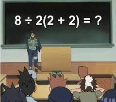

# Sintaxis

## R Calculadora {-}

```{r}
4 + 9
4 - 
  3 *
  1
#4%1

(4 + 5 ) * 7 - (36/18)^3
```


:::{#box1 .blue-box}
Ver [tablas resumen](#tablas_resumen) de operadores aritméticos y lógicos (al final del capítulo) 
:::

> Reto matemático que se volvió viral en las redes sociales*



Existen dos soluciones, según método que se aplique: el PEMDAS = 1 (parenthesis < exponents < multiplicación < division < addition < subtraction) y el BODMAS = 16 (Brackets < Orders (Powers and Square Roots) < Division < Multiplication < Addition < Subtraction). 

> Cómo opera R?

Se puede decir que hay diferencia de estilos al programar. Se deberia tener presente que otros pueden leer tu código (optar por buenas prácticas)

```{r}
(3+(5*(2^2))) # difícil de leer
3 + 5 * 2 ^ 2   # si se recuerdan las reglas, todo bien
3 + 5 * (2 ^ 2)   # si se olvidan algunas reglas, esto podría ayudar
```

## Comparaciones lógicas {-}

```{r}
4>3
4 == 4
4 == 4
4 != 3
1 >= -9
```

</br>

## Variables y asignaciones {-}

Podemos almacenar valores en variables usando el operador de asignación `<-`, veamos un ejemplo:

```{r}
x <- 1/40
```

Esta asignación no muestra el valor, sino que lo almacena para más adelante en algo llamado "variable". Que contiene x?

```{r}
x
```
:::{#box1 .blue-box}
shortcut de "<-" : `Alt -`
:::

Chequear la pestaña Environment en uno de los paneles de RStudio. Nuestra variable x se puede usar en lugar de un número en cualquier cálculo que espere un número:

```{r}
x <- x + 1 # observen cómo RStudio actualiza/sobrescribe x en la pestaña superior derecha
y <- x * 2
```

El lado derecho de la asignación puede ser cualquier expresión de R válida. La expresión del lado derecho se evalúa por completo antes de que se realice la asignación.


También es posible utilizar el operador = para la asignación

```{r}
x = 1/40
```

Esta forma es menos común entre los usuarios R (se recomienda usar `<-`).

</br>

## Funciones {-}

Como dijimos, los paquetes son básicamente un conjunto de funciones generadas por los autores de los mismos pero el usuario puede crear sus propias funciones.

Componentes de las funciones:

nombre_funcion(argumentos)

* *Nombre*: Generalmente, el nombre es intuitivo, por ejemplo, `mean` es la función que calcula la media, `round` es la funión que redondea un número.(Como habrán notado R está en inglés) 

* *Argumentos*: Un argumento es un marcador de posición. Cuando se invoca una función, se debe indicar valores a los argumentos. Los argumentos son opcionales; es decir, una función puede no contener argumentos. También los argumentos pueden tener valores por defecto.

Algunos cálculos basados en funciones matemáticas. Son las mas simples, y no esta funcion no contienen argumentos.
[para chequear la info de la función, solo basta con seleccionar todos sus caracteres + F1]

```{r}
sqrt(3) 
# 3^0.5 
# 3^(1/2)
log(10) # logaritmo natural
exp(2.302585)
# log(10, base=10)
```

Funciones básicas pero con argumentos

* Redondeo 

```{r}
round(4.3478)  
round(4.3478, digits=3)  

```

## Tips {-}

1 - No se tienen en cuenta los espacios en blanco entre palabras: podemos o no dejar espacios para que el código se pueda ordenar de forma adecuada y poder entenderse.

```{r}
plot( pressure )
plot(pressur e)
```

2 - Se distinguen las mayúsculas y minúsculas (“case sensitive”): para variables en el código, podemos crear diferentes variables con nombres iguales pero alternando mayúsculas y minúsculas.

```{r}
Plot(pressure)
```

3 - Se pueden incluir comentarios: como vimos anteriormente los comentarios se utilizan para añadir información en el código. De paso observamos que 

```{r}
plot(pressur e) # da error

# grafico press vs temp
plot(pressure)
```

Aprovechemos a ir describiendo los "argumentos" de las "funciones": 

```{r}
plot(pressure, # grafico press vs temp
     pch = 19, # cambio el tipo de puntos vacios a puntos llenos 
     col= "blue" # uso color azul para rellenarlos  
     )
```

4 - El punto y coma (;) actúa como separador de comandos aún en la misma línea del script!

```{r}
pressure; plot(pressure)
```

5 - Los nombres de las variables pueden contener letras, números, guiones bajos y puntos, pero *NO PUEDEN*: 

+ comenzar con un número 
+ contener espacios en absoluto 

Cada uno adopta su propia forma para nombres largos de variables, por ej:

- puntos.entre.palabras
- guiones_bajos_entre_palabras
- MayúsculasMinúsculasParaSepararPalabras

No importa como lo adopten, pero es aconsejable ser consistente.

## S.O.S. {-}

- En el mismo R: `?sd`;  `??sd`; F1 sobre la función 

> Googlear: *r generate a sequence of uppercase letters* 

- [Stack Overflow en inglés](https://stackoverflow.com/) / [Stack Overflow en español](https://es.stackoverflow.com) / 
[RStudio](https://community.rstudio.com/): comunidades altamente activas por los usuarios de R y otros lenguajes de programación.

- [R Mailing Lists](https://www.r-project.org/mail.html): especificas de cada área de la ciencia. 

**¿Cómo hacer una buena pregunta en las comunidades?**

- Ser conciso pero gentil...

- Ser reproducible: su código debe correr en cualquier máquina. La comunidad no irá a ayudarle si no pueden reproducir su error (detallar paquetes y versión de R en caso necesario) 

## Tablas resumen { - #tablas_resumen}

```{r echo=FALSE, eval=TRUE, results='asis'}
text_tab1 <- data.frame(
  Operador = c(
    "`x + y`", 
    "`x - y`", 
    "`x * y`", 
    "`x / y`",
    "`x %/% y`",
    "`x %% y`",
    "`x ^ y`"),
  Detalle = c("Suma de x e y",
              "Resta de x menos y",
              "Multiplicación", 
              "División de x por y", 
              "Parte entera de la división de x por y",
              "Resto de la división de x por y",
              "x elevado a y-ésima potencia (equivalente a **)")
)

```

```{r op-arit, tidy=FALSE, eval=TRUE, echo = FALSE}
library(kableExtra)
kable(text_tab1, caption = 'Operadores aritméticos', booktabs = TRUE) %>%
  kable_styling(full_width=F, font_size=15)
```

<br><br>

```{r, echo=FALSE, eval=TRUE}
text_tab2 <- data.frame(
  Operador = c(
    "x < y", 
    "x <= y", 
    "x > y", 
    "x >= y",
    "x == y",
    "x != y"),
  "Prueba lógica" = c(
    "x menor que y?",
    "x menor o igual que y?",
    "x mayor que y?",
    "x mayor o igual que y?",
    "x igual que y?",
    "x diferente que y?"
  )
)

```


```{r op-logi, tidy=FALSE, eval=TRUE, echo = FALSE, results='asis'}
knitr::kable(text_tab2, caption='Operadores lógicos', booktabs=TRUE) %>% 
  kable_styling(full_width=F, font_size=15)
```

<br>
<br>

```{r, echo=FALSE, eval=TRUE, tidy=FALSE, results='asis'}
text_tab3 <- data.frame(
  
  Operador = c(
    "`sqrt(x)`", 
    "`exp(y)`", 
    "`log(x)`", 
    "`log10(x)`",
    "`sum(x)`",
    "`prod(x)`",
    "`round(x, n)`"
  ),
  
  Detalle = c(
    "raiz de x",
    "exponencial de y",
    "logaritmo natural de x = ln",
    "logaritmo base 10 de x",
    "suma todos los elementos de x",
    "producto de todos los elementos de x",
    "redondea x a n-digitos"
  )
)

```


```{r matem, tidy=FALSE, eval=TRUE, echo = FALSE}
knitr::kable(text_tab3, 
             caption = 'Funciones matemáticas',
             booktabs = TRUE) %>% 
    kable_styling(full_width=F, font_size=15)

```

<br>
<br>

```{r, tidy=FALSE, eval=TRUE, echo = FALSE}
text_tab4 <- data.frame(
  Teclas = c(
    "Alt+Shift+K", 
    "Ctrl+Z / Ctrl+Shift+Z", 
    "Alt+ -", 
    "Ctrl+r",
    "Ctrl+l",
    "Ctrl+Shift+c",
    "Ctrl+Shift+d",
    "Ctrl+i"
  ),
  
  Detalle = c(
    "panel de todos los atajos",
    "undo/redo",
    "<-",
    "corre la línea/bloque completa de código",
    "limpia la consola",
    "silencia la línea de código",
    "duplica la línea de código",
    "indexa el bloque de código"
  )
)

```


```{r shortcuts, tidy=FALSE, eval=TRUE, echo = FALSE}
knitr::kable(text_tab4, caption = 'Algunos atajos comúnmente usados', booktabs = TRUE) %>% 
    kable_styling(full_width=F, font_size=15)
```

* Ver todos los atajos en R Studio `Ctrl | Shift | k` 

---
