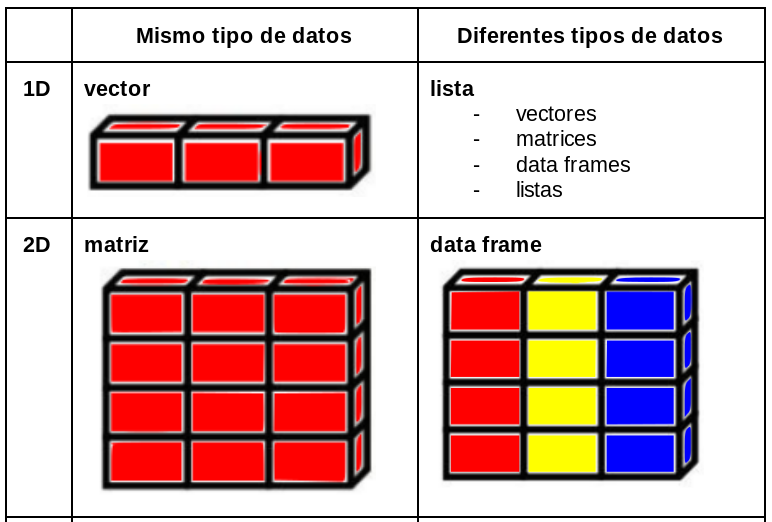

# Estructura de datos

<center>
{width=600px}
</center>

## Data frames {-} 

Conjunto de variables (columnas), de cualquier tipo de datos (categóricas, lógicas, fechas.

Un dataframe es completo con dimensiones n_fila x p_columna, donde:

1- Cada fila debe contener toda la info de la unidad experimental que se está evaluando

2- Cada columna representa una variable (descriptiva o respuesta)

3- Cada celda debe tener su observación (en caso de faltar el dato será un NA) 

 


```r
x <- c("A", "B", "C")
y <- c(1,3,5)

dat <- data.frame(x,y)
dat
str(dat)

dat$
```


```r
library(tibble)
dat <- tribble(
      ~x, ~y,
     "A",  1,
     "B",  3,
     "C",  5
     )
```

Como hemos visto, hay data frames contenidos en paquetes de inico automático. Un ejemplo muy usado, que está en el paquete `base` es el dataset "iris".


```r
iris # ya activo desde inicio de sesión por default
?iris # F1
View(iris) # F2 
str(iris)
```

<center>
{width=400px}
</center>

> Explore el dataset iris con las siguientes funciones y anote sus resultados:  
dim(); head(); tail(); names(); str(); summary()

:::{#box1 .blue-box}

### Otras estructuras de datos {-}

* Listas

Objetos que aceptan elementos de clases diferentes. 


```r
x <- list(a = 1:5, b = c("a", "b"), c = TRUE)
x
```

(Más info de subsetting elementos de una lista [aquí](https://bookdown.org/rdpeng/rprogdatascience/subsetting-r-objects.html#subsetting-lists))


```r
x$a       # 
x[1]       # 
#sum(x[1])
x[[1]]     # 
sum(x[[1]])
x["c"]     # 
```

* Matrices

Indicamos el número de filas con el argumento `nrow` y con `ncol` el número de columnas; luego indicamos qué valores forman la matriz (del 1 al 9), y le hemos pedido a R que use esos valores para rellenar la matriz A por filas con `byrow=TRUE`. La matriz A así construida es:


```r
A <- matrix(nrow=3, ncol=3, c(1,2,3,4,5,6,7,8,9), byrow=TRUE)
```

:::
