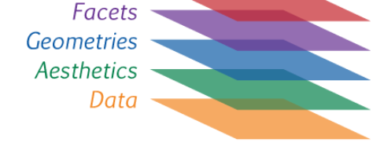

# Visualización 

## ggplot {-}

El paquete ggplot2 tiene una flexibilidad tal que permite generar rápidamente gráficos exploratorios así como crear figuras complejas, detalladas, de alta calidad (con fines de publicaciones científicas, por ej).

Tiene una gramática propia: **"suma de capas"**

* Las capas no tienen un orden estricto salvo la primera que debe ser `ggplot()`. 

* Un mismo gráfico acepta tomar información de distintos datasets

* Las capas se van agregando con un simbolo `+` 

Las capas básicas son:

- data `ggplot`: inicializa un objeto grafico de `ggplot`

- aesthetics `aes`: "Algo que se puede ver”
Dentro de la capa `aes` debemos indicar que a que variable se atribuyen los diferentes atributos: 
  + mapeo de variables (ejes `x=` e `y=`) 
  + color exterior de los objetos o de las líneas (`col`) 
  + color de relleno (`fill`)
  + forma de los puntos (`shape`) 
  + tipo de línea (`linetype`)
  + tamaño de los puntos (`size`)

- geometrias`geom_`: formas geométricas para representar las observaciones (dan el nombre al tipo de gráfico: grafico de dispersion, boxplot, histograma, etc...)
  + geom_point() 
  + geom_smooth() 
  + geom_boxplot()
  + [lista de "geoms"](https://ggplot2.tidyverse.org/reference/#section-layer-geoms)  
- facetas`facet_`: "paneles de compartimentalización" de un mismo gráfico
  + facet_wrap(): paneles contiguos
  + facets_grid(): paneles tipo grilla

{width=400px}

Ejemplo de visualización con `iris`

```{r, eval=T}
library(tidyverse)
```

## Ambas variables contínuas

```{r, eval=T}
ggplot(iris) +
  aes(x = Sepal.Length, y = Petal.Length)
```

* geoms

Objetos geométricos. Son la representación visual de las observaciones. En general los que le dan el nombre al tipo de gráfico. La [lista de "geoms"](https://ggplot2.tidyverse.org/reference/#section-layer-geoms) aumenta día a día.  

```{r, eval=T}
ggplot(iris) +
  aes(x = Sepal.Length, y = Petal.Length)+
  geom_point()
```

```{r, eval=T}
ggplot(iris) +
  aes(x = Sepal.Length, y = Petal.Length)+
  geom_point(aes(color = Species))
```

```{r, eval=T}
ggplot(iris) +
  aes(x = Sepal.Length, y = Petal.Length)+
  geom_point(aes(color = Species))+ 
  geom_smooth()
```

```{r, eval=T}
ggplot(iris) +
  aes(x = Sepal.Length, y = Petal.Length, color = Species) + 
  geom_point()+
  geom_smooth()
```

* facets

Las facetas o “facets” permiten dividir el mismo gráfico en múltiples paneles asociados a los niveles de un factor.

```{r, eval=T}
ggplot(iris) +
  aes(x = Sepal.Length, y = Petal.Length)+
  geom_point()+
  geom_smooth(method = "lm")+
  facet_wrap(~Species)
```

* theme

Los temas (theme) son un conjunto de opciones predefinidas sobre la apariencia de los objetos en ggplot. El tema por defecto del ggplot dibuja el gráfico sobre un fondo gris. Podemos cambiarlo a blanco y negro añadiendo el comando theme_bw().

```{r, eval=T}
ggplot(iris) +
  aes(x = Sepal.Length, y = Petal.Length)+
  geom_point()+
  geom_smooth(method = "lm")+
  facet_wrap(~Species) + 
  theme_bw()
```

### Como guardar los gráficos

```{r}
ggsave(last_plot(), file="plots/iris_smooth.tiff", 
       w=80, h=60, units="mm", dpi=300)
```

## Comparación de niveles de factores

Los gráficos de barra, ampliamente usados en publicaciones científicas, son cada vez más criticados por "ocultar" la naturaleza de las observaciones [@doi:10.1111/j.1476-5381.2011.01251.x; @10.1371/journal.pbio.1002128] 


```{block, type='rmdnote'}
De [@doi:10.1111/j.1476-5381.2011.01251.x]: Fig 1. Many different datasets can lead to the same bar graph.

The full data may suggest different conclusions from the summary statistics. The means and SEs for the four example datasets shown in Panels B–E are all within 0.5 units of the means and SEs shown in the bar graph (Panel A). p-values were calculated in R (version 3.0.3) using an unpaired t-test, an unpaired t-test with Welch’s correction for unequal variances, or a Wilcoxon rank sum test. 
- In Panel B, the distribution in both groups appears symmetric. Although the data suggest a small difference between groups, there is substantial overlap between groups. 
- In Panel C, the apparent difference between groups is driven by an outlier. 
- Panel D suggests a possible bimodal distribution. Additional data are needed to confirm that the distribution is bimodal and to determine whether this effect is explained by a covariate. 
- In Panel E, the smaller range of values in group two may simply be due to the fact that there are only four observations. Additional data for group two would be needed to determine whether the groups are actually different.
```

A continuación presentamos algunas opciones gráficas que surgen de la  combinación de medidas de posición y de dispersión.

```{r, eval=T}
#Aprovechamos para customizar el `theme` a nuestro gusto y agregar algunos detalles:
p0 <- 
  ggplot(iris) +
  aes(x = Species, y = Petal.Length)+
  labs(x = "Iris species", y ="Sepal length (cm)") + 
  theme_light(base_size = 10)
p0
```

### Observaciones + media / mediana

```{r, eval=T}
p1 <- p0 + 
  geom_point(shape = 1, alpha=0.2)+
  stat_summary(fun= mean,  #median
               fun.min= mean,
               fun.max = mean,
               geom = "point", 
               size = 2)+
  ggtitle("Observaciones (points) & media")
p1
```

```{r, eval=T}
p2 <- p0 + 
  geom_jitter(width = 0.2, alpha=0.2)+
  stat_summary(fun = mean,  #median
               fun.min= mean,
               fun.max = mean,
               geom = "crossbar", 
               size = 0.5)+
  ggtitle("Observaciones (jitter) & media")
p2
```


### Barplot + SE

```{r, eval=T}
p3 <-p0 + 
  # geom_bar(stat="identity") +
  stat_summary(fun=mean, position=position_dodge(width=0.95),geom="bar",
               colour="black",fill="grey90")+
  stat_summary(fun.data=mean_cl_normal, geom="errorbar", width=0.2) + 
ggtitle("Barplot & SEM")
  # geom_text(data= let, aes(label = M, x= trt, y=1, hjust=0.5),size = 4)
p3
```

### Box-plot 

```{r, eval=T}
p4 <-p0 + 
  geom_boxplot(fill = "grey90") +
  ggtitle("Boxplot & mean") 
p4
```

### Violin plot

```{r, eval=T}
p5 <-p0 + 
  geom_violin(trim=FALSE,fill = "grey90")+
  ggtitle("Violin plot")
p5 
```

### Media & dispersión

```{r, eval=T}
p6 <-p0 + 
  stat_summary(fun="mean", geom="point", size=2)+
  stat_summary(fun.data = mean_se, geom = "errorbar", width=0.2)+
  stat_summary(fun.data= mean_sdl, geom = "errorbar", color="red", width=0.2)+
  stat_summary(fun.data = mean_cl_boot, geom = "errorbar", color="blue", width=0.2)+
  ggtitle("Media + SE (negro) / SD (rojo) / 95% CI (negro)")
p6
```

```{r, eval=T, fig.width = 9, fig.height = 6}
library(cowplot)
plot_grid(p1, p2, p3, p4, p5, p6, ncol = 3, nrow = 2)
```


Si deseamos explorar las distribuciones de las variables podemos optar por un histograma o por diagramas de densidad.

```{r, eval=T}
cowplot::plot_grid(
iris %>% 
  ggplot(aes(Petal.Length, fill=Species)) +
  geom_histogram()+
  guides(fill=FALSE)
,
iris %>% 
  ggplot(aes(Petal.Length, fill=Species)) +
   geom_density(alpha=0.7)
, 
align="h"
)
```

:::{#box1 .blue-box}
  La gran comunidad de usuarios de R disponibiliza sus creaciones e incluso trabaja en extensiones que amplían la potencialidad de sus paquetes.

  Se podría afirmar que no hay límites para la creación. Digamos, que no importa el "**¿cómo?**" si no el "**¿qué?**"

  Algunas pruebas de ello son los siguientes links:

  - [The R Graph Gallery](https://www.r-graph-gallery.com/)
  - [Top 50 plots](http://r-statistics.co/Top50-Ggplot2-Visualizations-MasterList-R-Code.html)
  - [Extensiones de ggplot](http://www.ggplot2-exts.org/gallery/)
  - [Fundamentals of Data Visualization](https://serialmentor.com/dataviz/)

:::

