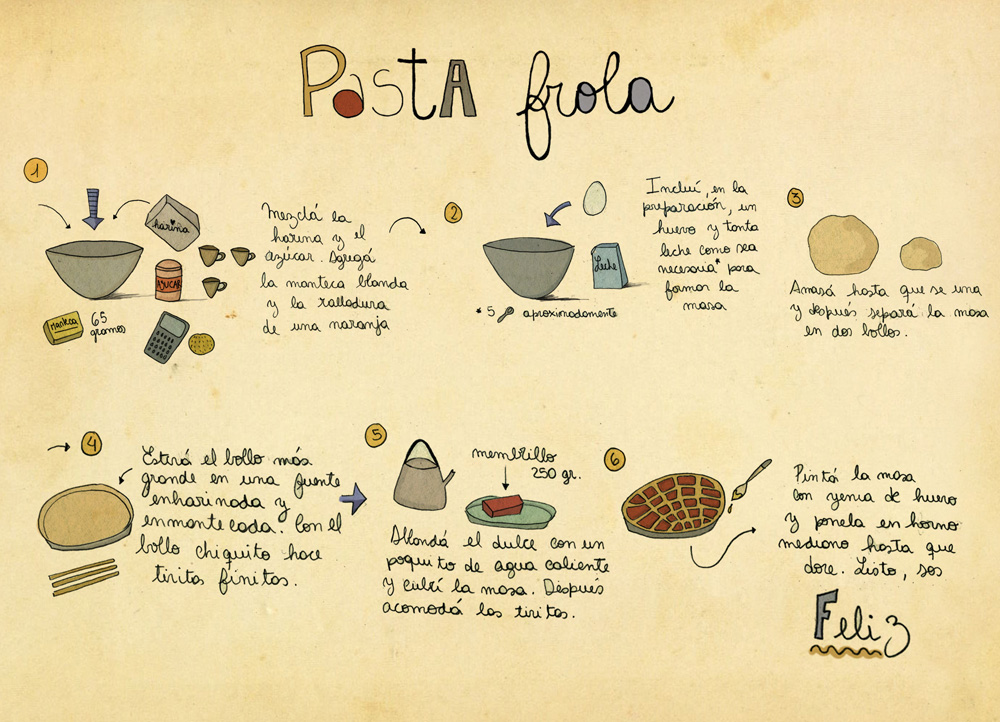
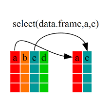

# {dplyr}

Recordemos la sintaxis R base

{width="200px"}

```{r}
x <- c(1, 2, 3, 4)
sqrt(sum(x))
```

Como sería su equivalente bajo la sintaxis de tidyverse?

{width="600px"}

```{r}
library(tidyverse)
```

```{r}
x %>% sum %>% sqrt
```

Ya tuvimos un primer panorama de la visualización de datos con `ggplot2`, que es parte el "universo ordenado".

Con el avance de nuestro trabajo con R iremos entendiendo el gran maridaje que tienen los paquetes entre si.

{width="200px"}

Empecemos con uno de los mas potentes paquetes del ecosistema tidyverse:

{width="150px"}

Para eso importemos el dataset balcarce desde la carpeta data

```{r}
bce_met_raw <- rio::import("data/datos_curso.xls", sheet ="bce_met")
str(bce_met_raw)
```

`dplyr` is a grammar of data manipulation, providing a consistent set of verbs that help you solve the most common data manipulation challenges:

## `mutate()` 

Son varias las manipulaciones que podemos realizar con dplyr  

1) Agregar nuevas variables en funcion de otras pre-existentes

{width="600px"}

> agreguemos la temperatura media en base a la tmin y tmax

```{r}
bce_met0 <- bce_met_raw %>% 
  mutate(tmean = (tmax + tmin) / 2)

head(bce_met)
```

2)  Modificar variables existentes

> pasemos "fecha" de formato caracter a su formato correcto

Acoplemos a `lubridate`

```{r}
library(lubridate)

bce_met1 <- bce_met0 %>% mutate(date = dmy(fecha))

head(bce_met1)
```

> ya que estamos extraigamos mas columnas relacionadas a la fecha

```{r}
bce_met1 <- bce_met1 %>% 
  mutate(month = month(date), 
         julian = yday(date))
head(bce_met1)
```

> creamos una nueva columna en base a una condición binaria

`if_else`

```{r}
bce_met1 <- bce_met1 %>% 
  mutate(frost = if_else(tmin<=0, TRUE, FALSE))
head(bce_met1)
```

> creamos una nueva columna en base a una condición multiple

`case_when`

```{r}
bce_met2 <- bce_met1 %>% 
  mutate(
    ambiente = case_when(
      tmean < 10  ~ "fresco", 
      tmean > 10 & tmean < 20  ~ "templado",
      tmean > 20  ~ "calido")
  )

bce_met2
```

## `select()` 

Selecciona variables basadas en sus nombres

{width=300px}


> Descartemos "fecha"

Opción 1

```{r}
bce_met2 <- bce_met1 %>% 
  select(date, month, tmean, tmax, tmin, rad, frost)

head(bce_met2)
```

Opción 2

```{r}
bce_met2 <- bce_met1 %>% 
  select(-fecha)

head(bce_met2)
```

Opción 3

```{r}
bce_met2 <- bce_met1 %>% 
  select(date, month, contains("tm"), rad, frost)

head(bce_met2)
```

## `filter()` 

{width=600px}

Filtra filas en base a alguna condición

> veamos que dias tuvieron heladas

```{r}
bce_met2 %>% 
  filter(tmin<=0)
```

```{r}
bce_met2 %>% 
  filter(frost==TRUE)
```

## `count()` 

Cuenta el numero de observaciones por grupo

```{r}
bce_met2 %>% 
  count(frost)
```

- se puede agregar mas niveles de agrupamiento

```{r}
bce_met2 %>% 
  count(month, frost)

bce_met2 %>% 
  count(frost, month)
```

##  `summarise()` 

{width=600px}
Reduce multiples valores a valores resumenes. Generalmente combinado con `group_by()`

> para cada mes: cuantos dias helaron y cual fue la temp media

```{r}
bce_met2 %>% 
  group_by(month) %>% 
  summarise(tmean=mean(tmean), 
            n_frost=sum(frost)) -> bce_sum
bce_sum
```

## `arrange()` 

Cambia el orden de las filas 

```{r}
bce_sum %>%
  arrange(n_frost)

bce_sum %>%
  arrange(-n_frost)
```

Ya que hicimos tantas modificaciones a los datos es un buen momento para guardar en formato `.Rdata`

```{r}
save(bce_met_raw, bce_met2, bce_sum, file="data/datos_curso.Rdata")
```

Gráfico de Temperaturas media

```{r}
ggplot(bce_met2) + 
  aes(x=date, y=tmean)+
  geom_line() +
  scale_x_date(date_breaks = "1 month", date_labels = "%b")+
  theme(axis.text.x = element_text(angle=45, hjust = 1)) + 
  labs(x="", y="Mean temperature (ºC)") + 
  theme_bw() + 
  theme(axis.text.x = element_text(angle=45, hjust = 1))
```

> nos interesa visualizar los meses en que se desarrolla el trigo (de junio a diciembre)

```{r}
ggplot(bce_met2) + 
  aes(x=date)+
  geom_line(aes(y = tmax, col = "Máxima"), alpha=.5) +
  geom_line(aes(y = tmin, col = "Mínima"), alpha=.5) +
  scale_colour_manual("Temperatura",
                      values = c("Media" = "black", 
                                 "Máxima" = "red", 
                                 "Mínima" = "blue"))+ 
    geom_point(data = bce_met2 %>% filter(tmin<3), 
             aes(x=date, y=0), 
             shape=8, col="blue") + 
  theme_bw() + 
  scale_x_date(date_breaks = "1 month", date_labels = "%b",
               limits = as.Date(c("2018-06-01", "2018-31-12")))+
  theme(axis.text.x = element_text(angle=45, hjust = 1))
```

## {forcats}

El paquete `{forcats}` hace un aporte clave para la manipulación de los niveles de un factor. Retomemos un ejemplo de tipico de visualización con `iris`

```{r}
iris %>%
  ggplot() +
  aes(x=Species, y=Sepal.Length)+
  geom_boxplot(fill="gray90")+
  geom_jitter()+
  labs(x= "Species", y="Sepal length (cm)") + 
  theme_bw()
```

> Reordenar niveles de un factor

```{r}
iris %>%
  mutate(
    Species= fct_relevel(Species,"virginica")
    ) %>%
  ggplot() +
  aes(x=Species, y=Sepal.Length)+
  geom_boxplot(fill="gray90")+
  geom_jitter()+
  labs(x= "Species", y="Sepal length (cm)") + 
  theme_bw()
```

> Renombrar niveles de un factor

```{r}
iris %>%
  mutate(
    Species= fct_recode(Species,
                        "Setosa"="setosa", 
                        "Versicolor"="versicolor", 
                        "Virginica"="virginica")
    ) %>%
  ggplot() +
  aes(x=Species, y=Sepal.Length)+
  geom_boxplot(fill="gray90")+
  geom_jitter()+
  labs(x= "Species", y="Sepal length (cm)") + 
  theme_bw()
```
