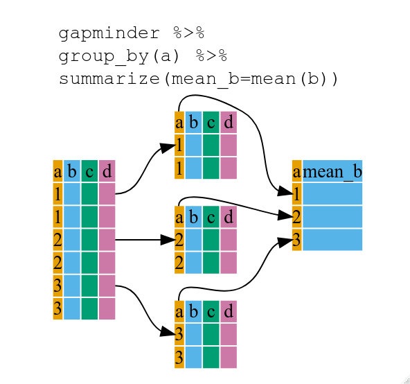
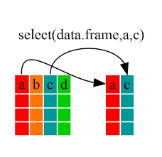

#Modificación 

Hasta el momento hemos:  

 + **importado** nuestros datasets 
 + **guardado** en formato .Rdata 
 + **cargado** para nuevas sesiones de trabajo
 + **re-estructurado** en algunos casos  

Ahora nos adentraremos en la **modificación**, **creación**, **filtrado** y **sumarización** de variables. 

Para ello usaremos a otro potente paquete del ecosistema tidyverse: 

{width=150px}

* Carguemos nuestros datos!


```r
load("data/datos_curso.Rdata") 
ls()
```

* Activemos tidyverse


```r
library(tidyverse) 
```

Las principales funciones que nos auxiliaran en esta tarea son la familia `mutate`

Retomemos los datos meteorológicos de Balcarce 2018 


```r
bce_met
bce_lluvias
```


```r
bce_full <- bce_met %>% 
  left_join(bce_lluvias, by="fecha")
bce_full 
```

Ya que lo anterior no seria eficiente tener que hacerlo en cada nueva sesión, actualicemos nuestro "banco de datos" del proyecto:

(primero borremos manualmente que datasets u objetos no queremos guardar)


```r
save.image("data/datos_curso.Rdata")
load("data/datos_curso.Rdata") 
```


## Modificar variables


```r
pacman::p_load(lubridate)

bce_full <- bce_full %>%
  mutate(fecha = lubridate::dmy(fecha))
bce_full
```


```r
bce_full <- bce_full %>% 
  mutate(pp = replace_na(pp, 0))
```

## Agregar variables 

Hasta aqui modificamos las variables "in-situ", ahora agreguemos unas columnas:

{width=600px} 

* Extrayendo informacion de la columna fecha:


```r
bce_full <- bce_full %>% 
  mutate(anio = year(fecha),
         mes = month(fecha),
         semana = week(fecha),
         juliano = yday(fecha))

bce_full
```

* Haciendo operaciones matemáticas/lógicas


```r
bce_full <- bce_full %>% 
  mutate(
    tmean = (tmax + tmin) / 2,
    helada_agro = if_else(tmin<3, TRUE, FALSE),
    helada_abs = if_else(tmin<0, TRUE, FALSE))
bce_full
```

* O condiciones multiples


```r
bce_full <- bce_full %>% 
  mutate(
    fav_enf = if_else(tmean>20 & pp> 3, TRUE, FALSE)
  )
```

> calcule el cociente fototermal diario siendo éste = la radiacion divido la temperatura media

# Sumarización 

{width=400px}

Temperatura media por mes


```r
bce_full %>% 
  group_by(mes) %>% 
  summarise(
    tmean=mean(tmean)
    )
```

Temperaturas extremas por mes


```r
bce_full %>% 
  group_by(mes) %>% 
  summarise(
    tmin=min(tmin), 
    tmax=max(tmax)
    )
```

> cuanto fue el mm acumulado por mes?

Cuantas heladas hubieron por mes?


```r
bce_full %>% 
  group_by(mes) %>% 
  summarise(
    helada_agro=sum(helada_agro), 
    helada_abs=sum(helada_abs)
    )
```

Cuantos dias llovieron "al menos" 3 mm por mes? 


```r
bce_full %>% 
  group_by(mes) %>% 
  summarise(pp_3=sum(pp>2))
```

Cuantas dias favorables para la infeccion hubieron por mes?


```r
bce_full %>% 
  group_by(mes) %>% 
  summarise(fav_enf = sum(fav_enf == TRUE))
```

# Selección 

Selección de variables con `select` y filtrado de filas con `filter` (ojo con el conflicto de filter!)

{width=300px}


```r
bce_full %>% 
  select(fecha, tmean)
```


```r
bce_full %>% 
  select(-anio)
```


```r
bce_full %>% 
 select(starts_with("t"))
```


```r
bce_full %>% 
  select(fecha, matches("helada"))
```


```r
bce_full %>% 
  select(fecha, tmean) %>% 
  mutate(tmean_ayer=lag(tmean),
         tmean_a_ayer=lag(tmean, 2),
         tmean_man=lead(tmean), 
         tmean_p_man=lead(tmean, 2))
```

# Filtrado

{width=600px}

* Filtrar fechas 


```r
bce_full %>% 
  filter(fecha < dmy("5/1/2018"))
```


```r
bce_full %>% 
  filter(fecha > dmy("2/1/2018"), fecha < dmy("5/1/2018"))
```

* Filtrar valores


```r
bce_full %>% 
  filter(tmean >20)
```

* Filtrar valores multiples


```r
bce_full %>% 
  filter(tmean >20, pp>10)
```


```r
p_tmin <- bce_full %>% 
  ggplot()+
  aes(x=fecha, y=tmin)+
  geom_line()+
  geom_point(data = bce_full %>% filter(tmin<3), 
             aes(x=fecha, y=0), 
             shape=8, col="blue")
```


```r
eval <- data.frame(fecha=dmy(c("10/10/2018","1/11/2018")))

p_tmin +
    geom_point(data = eval, 
             aes(x=fecha, y=20), 
             shape=25, size=4, fill="red") 
```
