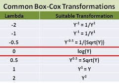

# Anova

```{r}
pacman::p_load(
  tidyverse,
  skimr,       # exploracion numerica de los datos
  performance, # evaluar performance de los modelos
  emmeans,     # medias estimadas por el modelo  
  multcomp     # comparar las medias entre si - tukey
  )
```

## Un solo factor {-} 

experimento DCA: dataset `PlantGrowth`

`?PlantGrowth`

```{r}
?PlantGrowth
pg <- PlantGrowth # simplificamos el nombre del dataset
pg
```

- Exploración  

```{r}
str(pg) # tipo de variables
```

```{r}
pg %>%   
  group_by(group) %>%
  skimr::skim() # exploración numérica
```

Exploración numérica

```{r}
pg %>% 
  group_by(group) %>% 
  summarise(
    n = sum(!is.na(weight)), 
    mean = mean(weight),
    sd = sd(weight))
```

Exploración gŕafica

```{r}
pg %>% 
  ggplot()+ 
  aes(x=group, y=weight) + 
  geom_boxplot(width=0.2)+
  geom_jitter(alpha=0.2, width=0.2)
```

Ajuste del modelo lineal

$$y_{ij} = \mu + \alpha_i + e_{ij}; \:\:i = 1,..., k; \:j = 1,..., n$$
$$N \sim (\sigma^2, 0)$$

```{r}
mod1 <- lm(weight ~ group, data = pg)  
```

- Diagnósticos

¿Las varianzas (entre niveles del factor) son homogéneas? 

```{r}
check_heteroscedasticity(mod1) %>% plot
# plot(mod1, which = 1)
# car::leveneTest(mod1)
```

¿Los residuos se distribuyen normales?

```{r}
check_normality(mod1) %>% plot
# plot(mod1, which = 2)
# shapiro.test(rstandard(mod1))
```

```{r}
anova(mod1)# caso balanceado
summary(mod1)
# car::Anova(mod1)# caso desbalanceado
```

Test de comparaciones múltiples (de medias estimadas de los tratamientos)

Paquete [emmeans](https://cran.r-project.org/web/packages/emmeans/vignettes/vignette-topics.html)

Medias e intervalos de confianza estimadas por el modelo

```{r}
em <- emmeans(mod1, ~ group, type="response")
em # %>% knitr::kable()
class(em)
```

Comparaciones múltiples 

```{r}
res  <- cld(em, 
            Letters = letters, 
            reverse = TRUE, 
            alpha = .05)  
res
pwpm(em, adjust = "none")

```

```{r}
res_tbl <- res %>% 
  mutate(letras=str_squish(.group))  

res_tbl
```

Graficar los resultados obtenidos del anova

- Opción A)

```{r}
res_tbl %>%  
  ggplot() +
  aes(x=group, y=emmean)+
  geom_pointrange(aes(ymin = lower.CL, ymax = upper.CL))+
  labs(x = "Tratamiento", y = "Peso (g)")+  
  geom_text(vjust=-1, angle=90, aes(label = letras))+
  geom_jitter(data = pg %>% rename(emmean = weight), 
             width = .1, alpha=0.2) +
  theme_bw()
```

Comparación de medias de los trat vs testigo (Dunnet)

```{r}
contrast(em, "trt.vs.ctrl1")
```

Comparación de medias por LSD

```{r}
library(agricolae)

res_lsd <- LSD.test(y = mod1, 
                    trt = "group",
                    group = T, 
                    console = T)
res_lsd
bar.group(x = res_lsd$groups, 
          ylim=c(0, 7),
          # main="Prueba de comparación de medias por medio del método LSD",
          # xlab="Tipo de Mezcla",
          # ylab="Rendimiento del proceso",
          col="steelblue")
```

## Dos factores {-} 

```{r}
library(tidyverse)
?ToothGrowth
tg <- ToothGrowth
```

- Exploración  

```{r}
str(tg) # tipo de variables
```

```{r}
tg1 <- tg %>% mutate_at(vars(dose), as.factor) 
```

```{r}
summary(tg1) # exploración numérica
```

```{r}
# exploracion numerica por tratamiento
tg1 %>%
  group_by(supp, dose) %>%
  skim()
  # summarise(
  #   count = sum(!is.na(len)),
  #   mean = mean(len, na.rm = TRUE),
  #   sd = sd(len, na.rm = TRUE)
  # )
```

¿cómo podemos reconocer un efecto de interacción? tratamos de notar si la relación entre un factor "A" y la variable respuesta es diferente para diferentes niveles de otro factor "B".

Con dos factores categóricos, que a menudo es el escenario que nos interesa, el enfoque de diagrama de caja en paralelo puede funcionar bastante bien:

```{r}
# Version 1
tg1 %>% 
  ggplot()  +
  aes(x = dose, y = len, col = supp) + 
  geom_boxplot() 
  # geom_line(aes(group=supp), stat = "summary", fun=mean) 

# Version 2 
tg1 %>%
  ggplot() +
  aes(x = supp, y = len, color = dose)+
  geom_boxplot()
```

Ajustar modelo 

```{r}
tooth_mod <-  lm(len ~ supp * dose, data=tg1) 
drop1(tooth_mod, test = "F")
# equivale a supp + dose + supp:dose
```

- Diagnósticos

¿Las varianzas (entre niveles del factor) son homogéneas? 

```{r}
check_heteroscedasticity(tooth_mod) # %>% plot
# plot(mod1, which = 1)
# car::leveneTest(mod1)
```

¿Los residuos se distribuyen normales?

```{r}
check_normality(tooth_mod) # %>% plot
# plot(mod1, which = 2)
# shapiro.test(rstandard(mod1))
```

avanzamos... 

```{r}
anova(tooth_mod)
summary(tooth_mod)
```

- comparaciones múltiples (un factor dentro del otro)

```{r}
pacman::p_load(emmeans, multcomp)
# emmip(mod2, supp~ dose)
```

```{r}
tooth_em <- emmeans(tooth_mod, pairwise ~ supp|dose, adjust="tukey")
cld(tooth_em, alpha=.05, Letters=letters)
```

```{r}
tooth_em2 <- emmeans(tooth_mod, pairwise ~ dose|supp, adjust="tukey")
cld(tooth_em2, alpha=.05, Letters=letters)
```

```{r}
tooth_em3 <- emmeans(tooth_mod, pairwise~supp*dose, adjust="tukey")
cld(tooth_em3, alpha=.05, Letters=letters)
```

```{r}
library(ggeffects)

ggpredict(tooth_mod, terms = c("dose", "supp")) %>% 
  plot()
```

# Transformaciones 

```{r}
dat <- read.csv("data/initech.csv")
```

```{r}
dat %>% 
  ggplot()+ 
  aes(years, salary) + 
  geom_point()
```

```{r}
fit  <- lm(salary ~ years, data = dat)
```

- Diagnósticos

¿Las varianzas (entre niveles del factor) son homogéneas? 

```{r}
check_heteroscedasticity(fit) # %>% plot
# plot(mod1, which = 1)
# car::leveneTest(mod1)
```

¿Los residuos se distribuyen normales?

```{r}
check_normality(fit) # %>% plot
# plot(mod1, which = 2)
# shapiro.test(rstandard(mod1))
```


```{r}
fit_log = lm(log(salary) ~ years, data = dat)
check_heteroscedasticity(fit_log) %>% plot
```

* Transformación potencia óptima de boxcox 

```{r}
boxcox(fit, plotit = TRUE)
```

sugiere transformacion boxcox

```{r}
fit_em <- emmeans(fit_log, ~ years, type = "response")

```


:::{#box1 .blue-box}

**Transformación potencia óptima de boxcox**

Esta transformación sólo tiene un parámetro: lambda, graficado en el eje x. Si el valor de lambda es igual a cero, se lleva a cabo la transformación con el logaritmo natural, y si dicho valor es distinto a cero la transformación es potencial. 

{width=300px} 

{width=350px}{width=350px}

Si el parámetro lambda es igual a uno, no hace falta transformar la variable respuesta. Si el intervalo (líneas punteadas verticales) no contiene a 0 ni a 1, hay que transformar la variable elevando a la potencia del valor de lamba incluido en el intervalo. 

La utilización de la transformación Box-Cox requiere que todos los valores de la serie de entrada sean positivos y distintos a cero.
Por ello es adicionada una constante a la variable original (0.5, por ej.).

En el caso de la derecha, el modelo resultaría: 

```{r}
lm((y+0.5)^0.2 ~ trt + bk, ...)
```
:::

<b>Lexturas recomendadas</b> 

- [Analysis and Interpretation of Interactions in Agricultural Research](https://dl.sciencesocieties.org/publications/aj/pdfs/107/2/748)

- [Analysis of Combined Experiments Revisited](https://dl.sciencesocieties.org/publications/aj/pdfs/107/2/763)

- [Model Syntax in R](http://conjugateprior.org/2013/01/formulae-in-r-anova/)

- [ANOVA: A Short Intro Using R](https://stat.ethz.ch/~meier/teaching/anova/)

- [glmmFAQ](https://bbolker.github.io/mixedmodels-misc/glmmFAQ.html)

- [A brief introduction to mixed effects modelling and multi-model inference in ecology](https://peerj.com/articles/4794/)

- [Data Analysis Examples](https://stats.idre.ucla.edu/other/dae/)

- [Data Analysis and Visualization in R for Ecologists](https://datacarpentry.org/R-ecology-lesson/index.html)

- [RNAseq analysis with R](http://monashbioinformaticsplatform.github.io/RNAseq-DE-analysis-with-R/)

:::
