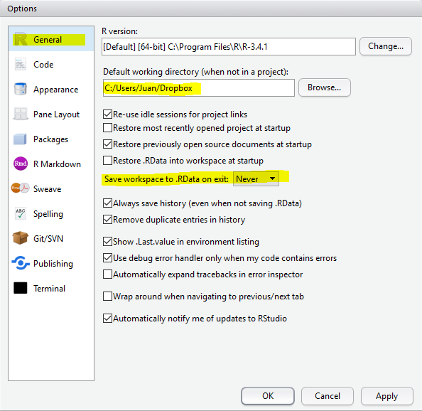
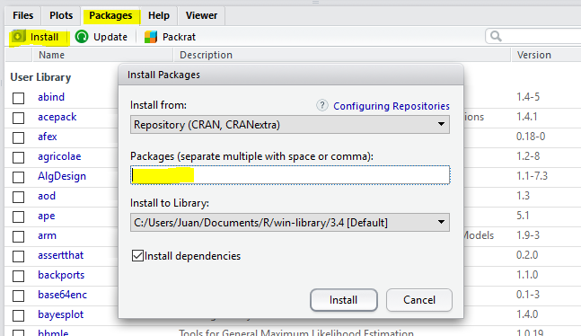
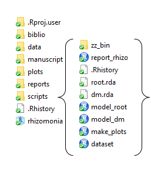
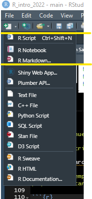

# Configuraciones básicas {#config}

<b>Instalación de programas</b>

1° [R](https://cran.r-project.org/) 

2° [R Studio](https://www.rstudio.com/products/rstudio/download/) (bajar la versión Free)


RStudio es un entorno de desarrollo integrado (IDE) para el lenguaje de programación R, o sea es la interface por medio de la cual se ejecutan acciones en R. 

Configuraciones iniciales (sugeridas). Dirigirse a la sección "Tools/Global options"

<center>



</center>


## Paquetes de R {-}

Un paquete es una colección de funciones, datos y código R que se almacenan en una carpeta conforme a una estructura bien definida, fácilmente accesible para R. 

Un repositorio es un lugar donde se alojan los paquetes para que pueda instalarlos desde él. Los repositorios mas populares son: 

[CRAN](https://cran.r-project.org/): repositorio oficial. Es una red de servidores web mantenida por la comunidad R en todo el mundo. El Core Team de R lo coordina, y para que un paquete se publique aquí, debe pasar varias pruebas que aseguren el cumplimiento de las políticas de CRAN.

[GITHUB](https://github.com/): probablemente el repositorio más popular para proyectos particulares de código abierto. No es específico de R (sin proceso de revisión asociado).

[Bioconductor](https://www.bioconductor.org/): repositorio destinado a software de código abierto para bioinformática. Como CRAN, tiene sus propios procesos de presentación y revisión, y su comunidad es muy activa y tiene varias conferencias y reuniones al año.

La simple instalación de R trae consigo múltiples paquetes que permiten un funcionamiento básico de importación de datos, ajuste y evaluación de modelos estadísticos y representaciones gráficas. Sin embargo, la enorme potencia de R deriva de su capacidad de incorporar nuevas funciones generadas por su gran comunidad de usuarios 

En la web de R se puede consultar la [lista de paquetes disponibles](https://cran.r-project.org/web/packages/available_packages_by_date.html), y en la sección [Task Views](https://cran.r-project.org/web/views/) se puede consultar los mismos ordenados por áreas de aplicación. 

:::{#box1 .blue-box}
Links para exploración o chequeo de novedades de paquetes:

- [Rdocumentation](https://www.rdocumentation.org)  

- [METACRAN](https://www.r-pkg.org/) 

- [r weekly](https://rweekly.org/)

- [r-bloggers](https://www.r-bloggers.com/)

- [revolution analytics](https://blog.revolutionanalytics.com/)

- [RStudio blog](https://blog.rstudio.com/categories/packages)

:::

Existen varias vias de instalación de paquetes:

</br>

<center>
 
</center>

</br>

- Via consola: `install.packages("nombre_del_paquete")` O simplemente en el panel de paquetes.  

</br>

:::{#box1 .blue-box}
Una vez instalado, hay que cargar los paquetes que contienen las funciones que vayamos a usar en cada sesión
:::

`library(nombre-del-paquete)`


> instale el paquete `pacman` y activelo

## Workflow componentes {-}

Varios tipos de archivos serán creados y usados durante una sesión de R: 

* datos crudos (hojas de cálculo) - datos manipulados
* scripts
* gráficos
* reportes de resultados

Una análisis debe poder ser retomado en cualquier momento pudiendo darse por concluída cuando el trabajo es publicado. Hasta entonces debemos tener rápido acceso a todos los objetos creados en *sesiones* anteriores. Para ello debemos manejarnos siempre bajo *buenas prácticas* de trabajo. Esto nos permitirá entender qué quisimos hacer tiempo atrás, seremos intuitivos para encontrar archivos/objetos, y finalmente crearemos trabajos *reproducibles*...   
Una forma práctica de administrar todos los objetos de una sesión es por medio del uso de "proyectos" de R Studio. 

 

Estructura típica de un proyecto de Rstudio. Es aconsejable ser consistente en la nomenclatura de todos los objetos generados en nuestras sesiones de trabajo (archivos, carpetas, etc.). 

<center>
 
</center>

> Crear una nuevo proyecto llamado "R_intro"


```{=html}
<div class="vembedr">
<div>
<iframe src="https://www.youtube.com/embed/5brYbPkzm4k" width="533" height="300" frameborder="0" allowfullscreen="" data-external="1"></iframe>
</div>
</div>
```

> Crear un script "dia_1"

<center>
 
</center>

¿Dónde se guardaría el siguiente gráfico?

> En este ejemplo, usaremos una función "plot()" y un dataset "pressure" prediseñados en paquetes de carga automática al iniciar R. 


```r
plot(pressure)
```


