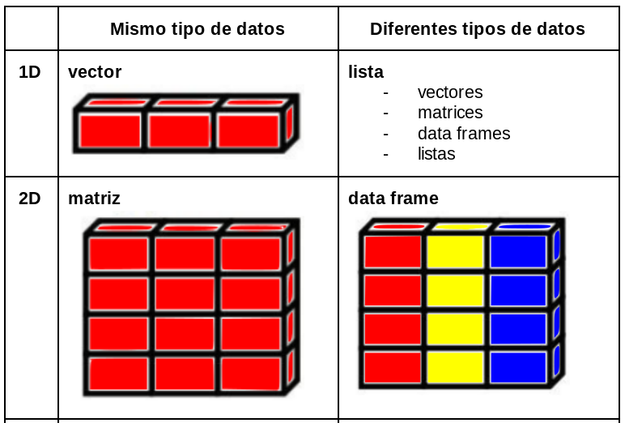

# Estructura de datos

<center>
{width=600px}
</center>

## Data frames {-} 

Conjunto de variables (columnas), de cualquier tipo de datos (categóricas, lógicas, fechas.

Un dataframe es completo con dimensiones n_fila x p_columna, donde:

1- Cada fila debe contener toda la info de la unidad experimental que se está evaluando

2- Cada columna representa una variable (descriptiva o respuesta)

3- Cada celda debe tener su observación (en caso de faltar el dato será un NA) 

 

Como hemos visto, hay data frames contenidos en paquetes de inico automático. Un ejemplo muy usado, que está en el paquete `base` es el dataset "iris".


```r
iris # ya activo desde inicio de sesión por default
?iris # F1
View(iris) # F2 
str(iris)
```

<center>
{width=400px}
</center>

> Explore el dataset iris con las siguientes funciones y comente sus resultados:  
dim(); head(); tail(); names(); str(); summary()


```r
str(iris)
summary(iris)
```


```r
dim(iris) 
head(iris)
tail(iris)
names(iris)
```

Paquetes de exploracion rapida de datasets

{skimr}


```r
library(skimr)
skim(iris)
```

:::{#box1 .blue-box}

Creacion de dataframes a partir de vectores


```r
x <- c("A", "B", "C")
y <- c(1, 3, NA)

dat <- data.frame(x,y)
dat
str(dat)

dat$
```


```r
library(tibble)
dat <- tribble(
      ~x, ~y,
     "A",  1,
     "B",  3,
     "C",  NA
     )
```

### Otras estructuras de datos {-}

* Listas

Son vectores de objetos de cualquier clase


```r
x <- list(a = 1:5, b = c("a", "b"), c = TRUE, d=dat)
x
```

(Más info de subsetting elementos de una lista [aquí](https://bookdown.org/rdpeng/rprogdatascience/subsetting-r-objects.html#subsetting-lists))


```r
x$a       # 
x[1]       # 
#sum(x[1])
x[[1]]     # 
sum(x[[1]])
x["c"]     # 
```

* Matrices

Admiten un unico tipo de dato y carecen de nombre de columna. Al igual que los dataframes tienen dimensiones fila x columna. Indicamos el número de filas con el argumento `nrow` y con `ncol` el número de columnas; luego indicamos qué valores forman la matriz (del 1 al 9), y le hemos pedido a R que use esos valores para rellenar la matriz A por filas con `byrow=TRUE`. La matriz A así construida es:


```r
A <- matrix(nrow=3, ncol=3, c(1,2,3,4,5,6,7,8,9), byrow=TRUE)
A
```

:::
