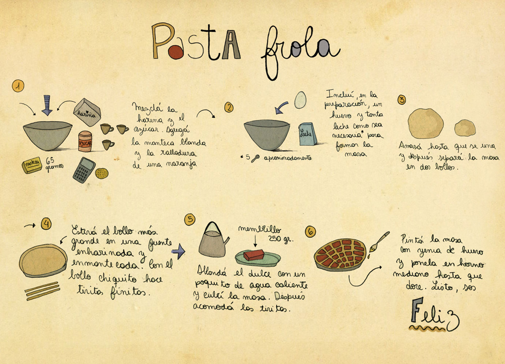

#Tidyverse

<center>
  {width=600px}
</center>

---

Sintaxis R base

{width=200px}


```r
x <- c(1, 2, 3, 4)
sqrt(sum(x))
```

Como sería su equivalente bajo la sintaxis de tidyverse?

{width=400px}


```r
library(tidyverse)
x %>% sum %>% sqrt
```

* Volvamos a nuestros datos!


```r
load("data/datos_curso.Rdata") 
```


```r
soja
str(soja)
```

Es evidente que necesitamos re-estructurar este dataset no? 

{width=200px}

{width=200px}


```r
library(tidyr) # no hace falta si activamos tidyverse!
```

Son varias las funciones útiles de este  paquete, pero nos centraremos en `pivot_longer()`. La hermana de ésta, que cumple la funciòn inversa es `pivot_wider()`. Otras muy útiles funciones son `separate()` y `unite()` para separar o unir contenidos caracteres de columnas. Otras como `drop_na()`, `complete()`  

:::{#box1 .blue-box}
Full detalle de tidyr en: 

  - [Sitio oficial](https://tidyr.tidyverse.org/reference/index.html)
  - [R para ciencia de datos](https://es.r4ds.hadley.nz/datos-ordenados.html)
:::


# Wide a long 

pivot_longer

"Wide" -> "long"


```r
soja_long <- soja %>% 
  pivot_longer(
    cols = starts_with("bk"),
    names_to = "bk",
    names_prefix = "bk_",
    values_to = "rinde"
  )

soja_long
```

Hagamos un último control de calidad...


```r
str(soja_long)

soja_long <- soja_long %>% 
  mutate_at(vars(trt, bk), as.factor)

soja_long
```

Ahora si, listo para un primer gráfico (por el momento no importa la apariencia)...


```r
soja_long %>% 
  ggplot() + 
  aes(x=trt, y =rinde) + 
  geom_point(alpha=0.2) 
  # geom_text(aes(label=bk), hjust=2)+
  # stat_summary(fun=mean, col="red")
```

:::{#box1 .blue-box}

`stat_summary()` es otra función que potencia al paquete `{ggplot2}` ya que no necesitamos haacer cálculos previos (como en cualquier otro software)

:::

# Unir dataframes 


```r
library(dplyr) # no hace falta si activamos tidyverse!
```

En esta etapa del flujo de trabajo introduciremos `{dplyr}` apenas con la funciones `join()` y `mutate()`.

:::{#box1 .blue-box}
Full detalle de dplyr en: 

  - [Sitio oficial](https://dplyr.tidyverse.org/)
  - [R para ciencia de datos](https://es.r4ds.hadley.nz/datos-relacionales.html)
:::

{width=300px}
Veamos los datos meteorologicos de Balcarce:


```r
bce_met
bce_lluvias
```

> que pueden observar?


```r
bce_full <- bce_met %>% 
  left_join(bce_lluvias, by="fecha") %>% 
  mutate(pp = replace_na(pp, 0))
bce_full 
```

Ahora si, veamos el data-type!  


```r
bce_full
```


```r
bce_full <- bce_full %>%
  mutate_at(vars(fecha), lubridate::dmy)

bce_full
```

:::{#box1 .blue-box}

`scale_x_date` permite formatear los rótulos de los ejes de fchas: 

Podemos usaar diferentes combinaciones de dias, semanas, meses y años:

+ nombre del mes name:  %b (abreviado) o %B (completo)
+ %d: día del mes como nro decimal
+ %Y: año completo
+ todas las opciones en ?strptime
:::

Temperaturas juntas en el mismo gráfico...


```r
bce_full %>% 
  ggplot() + 
  aes(x=fecha)+
  geom_line(aes(y = tmax, col = "Máxima")) +
  geom_line(aes(y = tmin, col = "Mínima")) +
  scale_colour_manual("",
                      values = c("Máxima" = "red", "Mínima" = "blue")
                      )+
  scale_x_date(date_breaks = "1 month", date_labels = "%b",
               limits = as.Date(c("2018-01-01", "2018-31-12")))+
  theme(axis.text.x = element_text(angle=45, hjust = 1))
```

Y lluvias? 


```r
bce_full %>% 
  ggplot() + 
  aes(x=fecha)+
  geom_col(aes(y = pp)) 
```

# Reordenar niveles de un factor

El paquete `{forcats}` podria incluirse en los logos de la taza ya que hace un aporte clave para la manipulación de los niveles de un factor. En la clase de repaso vimos este ejemplo con el dataset `iris` 


```r
iris %>%
  mutate(
    Species= fct_relevel(Species,"virginica")
    ) %>%
ggplot() +
  aes(x=Sepal.Length)+
  geom_histogram()+
  facet_wrap("Species")+
  theme_bw()+
  labs(x= "Largo del sépalo (cm)", y = "Número de casos")
```


:::{#box1 .blue-box}
  La gran comunidad de usuarios de R disponibiliza sus creaciones e incluso trabaja en extensiones que amplían la potencialidad de sus paquetes.

  Se podría afirmar que no hay límites para la creación. Digamos, que no importa el "**¿cómo?**" si no el "**¿qué?**"

  Algunas pruebas de ello son los siguientes links:

  - [The R Graph Gallery](https://www.r-graph-gallery.com/)
  - [Top 50 plots](http://r-statistics.co/Top50-Ggplot2-Visualizations-MasterList-R-Code.html)
  - [Extensiones de ggplot](http://www.ggplot2-exts.org/gallery/)

  - [Fundamentals of Data Visualization](https://serialmentor.com/dataviz/)

  El paquete [ggplot2](http://r4ds.had.co.nz/data-visualisation.html) tiene una flexibilidad tal que permite generar rápidamente gráficos exploratorios así como crear figuras complejas, detalladas, de alta calidad (con fines de publicaciones científicas).
:::
