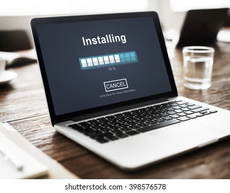
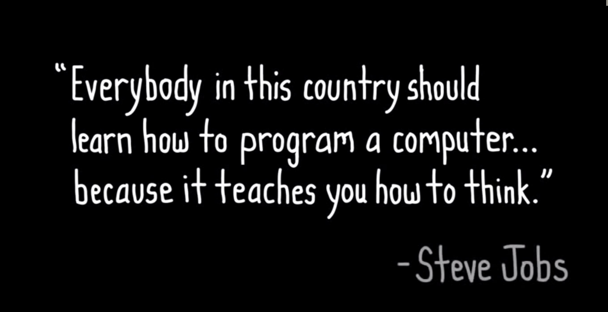
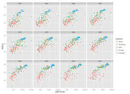
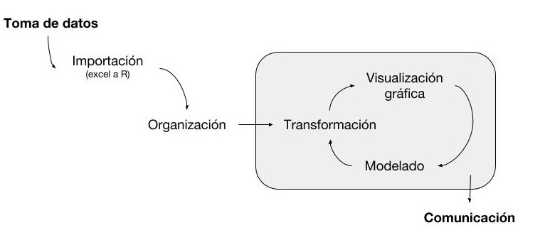
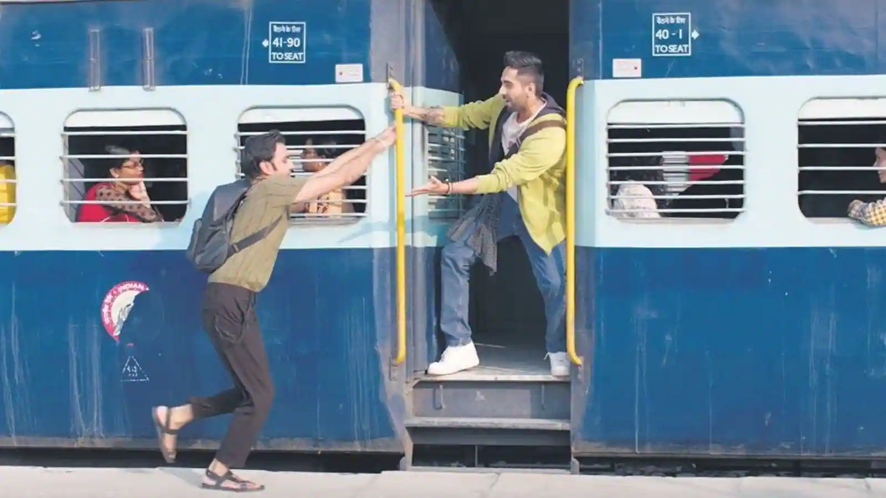

# Motivación {.unnumbered}


*"Una de las cosas más importantes que puedes hacer es dedicar un tiempo para aprender un lenguaje de programación. Aprender a programar es como aprender otro idioma: requiere tiempo y entrenamiento, y no hay resultados prácticos inmediatos. Pero si superas esa primera subida empinada de la curva de aprendizaje, las ganancias como científico son enormes. Programar no sólo te liberará de la camisa de fuerza de los softwares estadísticos cerrados, sino que también agudizará tus habilidades analíticas y ampliará los horizontes de modelado ecológico y estadístico."*

::: {style="text-align: right"}
\~ Adaptación de [@ellison2004primer] \~
:::

------------------------------------------------------------------------

::: {style="text-align: center"}
<b>¿Por qué R?</b> [@R-base]
:::

1.  Software libre - multiplataforma

    <center>

    {width="300px"}

    </center>

2.  Aprender un lenguaje de programación: ejercicio mental/lógica (Mayor aprovechamiento de otros cursos específicos)

<center>

{width="300px"}

</center>

<center>

(Si quieren aprender a fondo matemática, aprendan programación, si quieren aprender a fondo biología, aprendan programación...)

{width="300px"}

</center>

3.  Amplia gama de paquetes específicos

<center>

{width="300px"}

</center>

4.  Gran flexibilidad y elegancia de los gráficos

<center>

{width="300px"}

</center>

5.  Popularidad - Comunidad activa y creciente dispuesta a ayudar (aprendemos a usar terminos técnicos de data science en inglés)

<center>

{width="300px"}

</center>

6.  Programar ya no es sólo computación (CV/relevant skills)

<center>

{width="300px"}

</center>

------------------------------------------------------------------------

# Objetivos {.unnumbered}

-   Proveer en *3 semanas* de curso un pantallazo de las herramientas que pueden optimizar la labor cotidiana *a lo largo de la vida* como recolector/analista de datos.

</center>



::: {style="text-align: right"}
\~ Adaptación de "R for Data Science" [@wickham2016r] \~
:::

-   Acompañar la primer fase empinada de la curva de aprendizaje de un nuevo lenguaje, que a la larga redituará en multiples beneficios tanto profesionales como personales.

<center>

{width="200px"}

</center>

-   Brindar un sistema flexible de aprendizaje en cuanto a los horarios de cada uno y, en caso de ser necesario, un soporte personalizado para llegar a la meta de que "todos salgan andando con R".

<center>

{width="300px"}

</center>

**Importante:**

i)  no es un curso de estadística

ii) entendemos la programación como un simple medio para optimizar nuestra labor cotidiana (no como un fin mismo), al final del día seguimos siendo fitopatólogos, veterinarios, bioquímicos, etc.

iii) maximizaremos la adopción de la sintaxis [tidyverse](https://www.tidyverse.org/)


# Sobre el curso {.unnumbered}


```r
Se disponibiliza de este manual web con los códigos que se irán reproduciendo en las clases teoricas para la reproducibilidad en las computadoras personales. Para ello debe cliquearse el icono en el angulo superior derecho de los bloques grises y asi se copia todo su contenido. 
```

:::{#box1 .blue-box}
Códigos en marcos azules son material suplementario para quienes quieran profundizar en horario extra-clase. 
:::
