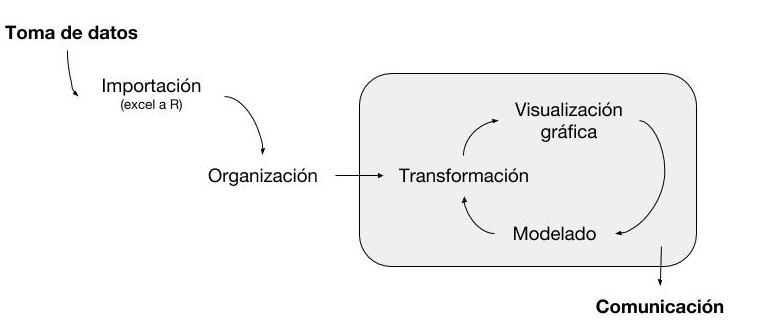

--- 
title: "Exploración y manipulación de datos con R"
author: ""
output: bookdown::gitbook
site: bookdown::bookdown_site
documentclass: book
bibliography: [book.bib, packages.bib]
biblio-style: apalike
link-citations: no
github-repo: juanchiem/R_intro_2022
---

```{r include=FALSE}
library(knitr)
opts_chunk$set(echo = TRUE, 
               warning = FALSE, 
               message = FALSE, 
               eval=FALSE, 
               fig.width = 6,
               fig.height = 4)

options(width = 90)

all_rmd <- list.files(path = here::here(), 
                         pattern = ".Rmd", 
                         all.files = TRUE, full.names = TRUE)
dput(all_rmd) 
```

```{r include=FALSE, eval=F}
library(knitr)
library(rmdformats)
library(tidyverse)
library(kableExtra)

## Global options
options(max.print="75")
opts_chunk$set(echo=TRUE,
	             cache=TRUE,
               prompt=FALSE,
               tidy=TRUE,
               eval=FALSE,
               comment=NA,
               message=FALSE,
               warning=FALSE)
opts_knit$set(width=75)
```

# Motivación {-}


*"Una de las cosas más importantes que puedes hacer es dedicar un tiempo para aprender un lenguaje de programación. Aprender a programar es como aprender otro idioma: requiere tiempo y entrenamiento, y no hay resultados prácticos inmediatos. Pero si superas esa primera subida empinada de la curva de aprendizaje, las ganancias como científico son enormes. Programar no sólo te liberará de la camisa de fuerza de los softwares estadísticos cerrados, sino que también agudizará tus habilidades analíticas y ampliará los horizontes de modelado ecológico y estadístico.”*

<div style="text-align: right">  ~ Adaptación de [@ellison2004primer] ~ </div>

---

<div style="text-align: center">
<b>¿Por qué R?</b> [@R-base]
</div>


1. Software libre - multiplataforma

2. Aprender un lenguaje de programación: ejercicio mental/lógica (Aprender estadística resulta mucho más ameno)

<center>
{width=400px}
</center>

3. Amplia gama de paquetes específicos

<center>
{width=400px}
</center>

4. Gran flexibilidad y elegancia de los gráficos

 <center>
{width=300px}
</center>

5. Popularidad - Comunidad activa y creciente dispuesta a ayudar (aprendemos a usar terminos técnicos de data science en inglés)
 
 <center>
{width=400px}
</center>

6. Programar ya no es sólo computación (CV/relevant skills) 

---

# Objetivos {-}

* Acompañar la primer fase empinada de la curva de aprendizaje de un nuevo lenguaje, que a la larga redituará en multiples beneficios tanto profesionales como personales. 

{width=200px}


* Proveer herramientas que optimicen nuestra labor cotidiana como recolectores/analistas de datos a lo largo de todo el flujo de trabajo 

 

<div style="text-align: right">  ~ Adaptación de "R for Data Science" [@wickham2016r] ~ </div>

**Importante:** 

i) no es un curso de estadística

ii) entendemos la programación como un simple medio para optimizar nuestra labor cotidiana (no como un fin mismo), al final del día seguiremos siendo fitopatólogos, fisiólogos,  bioquímicos, etc.

iii) maximizaremos la adopción de la filosofía [tidyverse](https://www.tidyverse.org/) 
